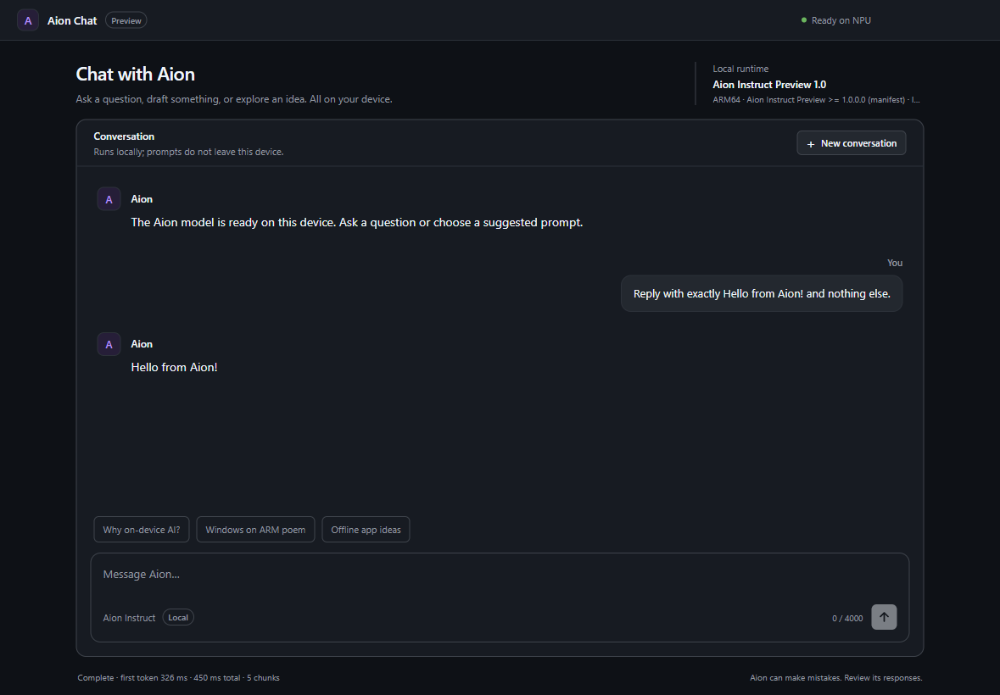

# Electron Aion Instruct chat

This sample runs **Aion Instruct Preview 1.0** locally on a Snapdragon
Copilot+ PC and streams its response into a React UI in Electron through
`dynwinrt`.



The sample demonstrates:

- React components and a chat hook for messages, streaming updates, and UI state;
- the WinRT model client is owned by Electron's context-isolated preload;
- `contextBridge` exposes only model lifecycle, generation, cancellation, and
  conversation-reset operations;
- incremental `IAsyncOperationWithProgress` values stream into the renderer;
- an `AbortController` cancels the native WinRT operation; and
- `LanguageModelContext` and `LanguageModel` are closed deterministically.

The window uses a single-screen grid: the page itself never scrolls, suggested
prompts wrap instead of creating a horizontal scrollbar, and the message
history keeps wheel/touch scrolling without visible scrollbar chrome.

Aion does not require a Limited Access Feature token. The preview ships as a
framework MSIX. WinApp CLI applies a development package identity to Electron,
and `Package.appxmanifest` statically places the Aion framework in the process
package graph before the WinRT class is activated.

## Requirements

- Windows 11 on an **ARM64 Snapdragon Copilot+ PC**
- A certified Qualcomm QNN execution provider
- Windows App Runtime 2, version `2.0.1.0` or newer
- Windows App Runtime 1.8, version `8000.836.2153.0` or newer
- Aion Instruct Preview SDK/framework 1.0.0.0
- Developer Mode for installing the preview framework
- Node.js 22.12+ and the Rust toolchain used by this repository
- Windows 11 SDK, which provides the `Windows.winmd` references used during
  binding generation

Install the preview with Microsoft's official bootstrap:

```powershell
git clone https://github.com/microsoft/Aion-Instruct-Preview-Sample
cd Aion-Instruct-Preview-Sample
Set-ExecutionPolicy -Scope Process -ExecutionPolicy Bypass
.\Bootstrap.ps1 -SkipLaunch
```

Microsoft's bootstrap currently also requires the .NET 9 SDK. It installs the
Aion framework and prepares the QNN provider; this Electron sample itself does
not use .NET.

The current preview supports Snapdragon ARM64 only. Intel/AMD x64 support is
planned but is not available in SDK 1.0.0.0.

## Run

Build the repository's local JavaScript binding:

```powershell
cd bindings\js
npm install
npm run build
```

Then install and launch the sample:

```powershell
cd ..\..\samples\js\electron-aion-chat
npm install
npm start
```

`npm start` regenerates the WinRT projection, builds the React renderer with
TypeScript and Vite, and runs
`winapp node add-electron-debug-identity` before launching Electron. Re-run
`npm run configure` after changing `Package.appxmanifest`. Development launches
apply Electron's documented `no-sandbox` workaround for sparse debug identity.
The BrowserWindow also uses `sandbox: false` because its preload loads the
native dynwinrt addon; `contextIsolation`, disabled renderer Node integration,
CSP, and the narrow bridge remain the security boundary.

The debug identity remains registered between runs. Restore the Electron binary
and unregister the sparse package when finished:

```powershell
npm run clear-identity
```

To launch with an automatic first prompt:

```powershell
npm run demo
```

Exercise Send, Stop, and New conversation in the React UI with real Aion
inference, and check the single-screen layout:

```powershell
npm run validate
```

`npm run generate` reads `AionInstructPreview.Text.winmd` from the installed
framework package (or the NuGet cache) and emits the local JS/TypeScript
projection under the ignored `generated` directory. Set
`DYNWINRT_AION_WINMD` to override discovery.

The renderer reaches Aion only through the preload's narrow `contextBridge`.
Vite bundles only the renderer into `out\renderer`; main, preload, and the native
addon are not bundled. Use `npm run build` to rebuild just the UI.
All model calls use generated WinRT bindings and the standard dynwinrt runtime;
there is no Aion-specific native adapter in `dynwinrt`.

The manifest declares both required runtime families. Windows selects the
latest compatible Windows App Runtime 2 package, while Aion Preview 1.0 keeps
its WinML/ORT/QNN inference path on the latest compatible 1.8 servicing
release.

Aion 1.0 is an experimental small model and can hallucinate facts about private
projects it has not seen. This sample deliberately sends the user's prompt
unchanged. Production applications should add task-specific grounding,
retrieval, output validation, and content-safety policy rather than hard-code a
special answer into the transport layer.

## Packaging

`Package.appxmanifest` is directly usable for WinApp CLI development identity.
For an MSIX release, include the built `out\renderer`, preload, and generated
bindings in the Electron layout, change `Executable` to
the packaged executable path, and replace the sample identity/publisher with
the values used by the signing certificate or Microsoft Store reservation.
