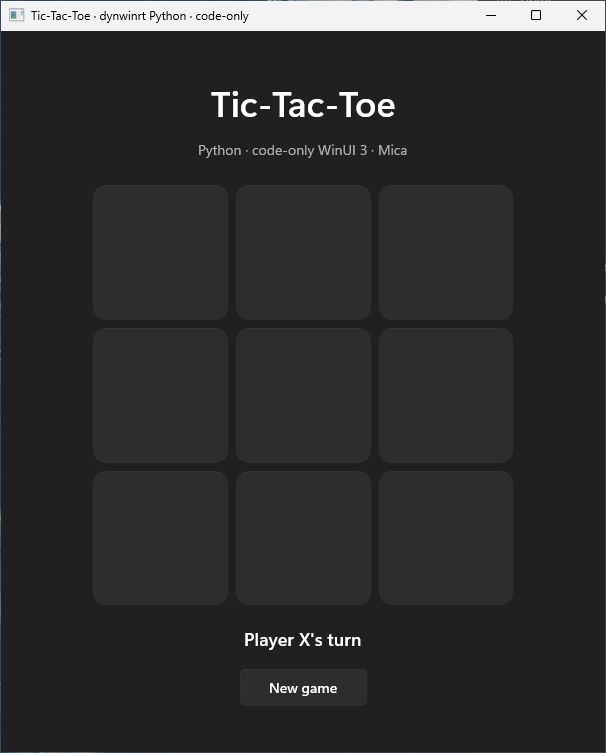

# Python WinUI Tic-Tac-Toe (code-only)

A polished, playable 3x3 Tic-Tac-Toe sample built entirely in Python with
generated WinUI 3 projections. `Application`, `Window`, every layout object,
grid definition, control, event handler, and game-state transition is created
programmatically. The sample uses the default Fluent control resources and
constructs a Mica system backdrop through its generated composable projection;
it does not load or register XAML.



## Prerequisites

- Windows 11 on x64 with CPython 3.11–3.14.
- WinApp CLI 0.6.2 or newer.
- `dynwinrt` installed in the Python interpreter used to run the sample.
- Matching `dynwinrt` and `dynwinrt-codegen` versions.

Install the published preview packages:

```powershell
python -m pip install --pre dynwinrt dynwinrt-codegen
```

For source-checkout development, build `dynwinrt-codegen` and install the
runtime with `python -m maturin develop --release` from `bindings\py` instead.

Restore the pinned Windows App SDK, generate the Python projection, and run:

```powershell
winapp restore
.\generate.ps1
.\run.ps1 -Python C:\path\to\python.exe
```

`winapp restore` prepares the pinned SDK metadata and bootstrap binaries under
`.winapp\`. `generate.ps1` uses that metadata to generate Python bindings and
copies the selected architecture's bootstrap DLL to `.runtime\`. Before
calling `init_winappsdk(2, 3)`, `app.py` sets
`WINAPPSDK_BOOTSTRAP_DLL_PATH` to that local copy.

Pass `-Codegen ..\..\..\target\release\dynwinrt-codegen.exe` when testing a
source build.

Players alternate selecting cells. Choose **New game** after a win or draw to
reset the board. Closing the window exits the WinUI application and releases
projected objects deterministically.

`generated\`, `.runtime\`, and Python caches are local artifacts and are not
tracked.
